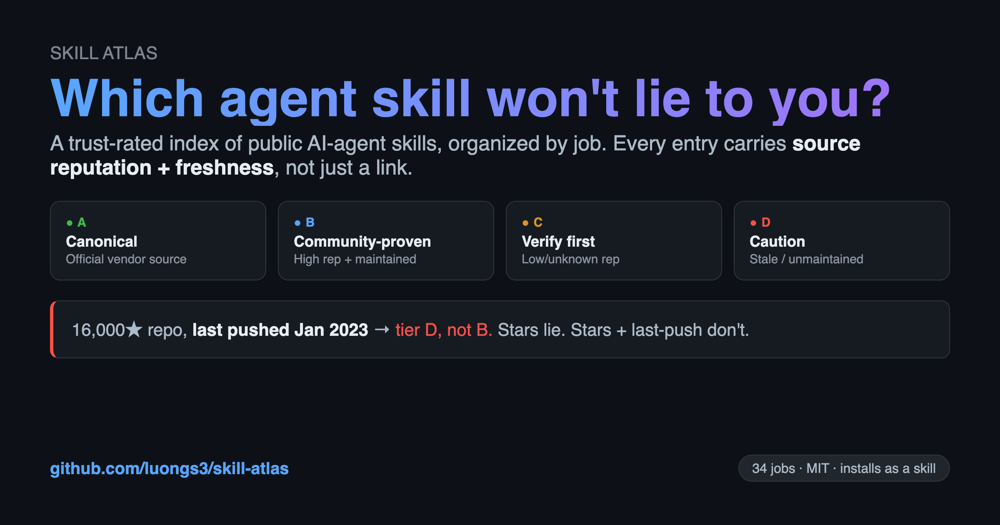
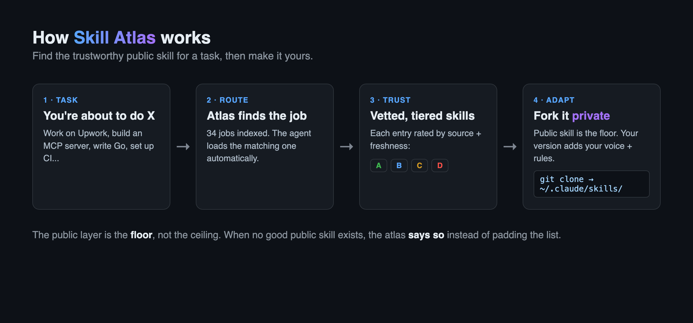

# Skill Atlas



**A curated, trust-rated index of public AI-agent skills, organized by job.**

This is not a skill store and not another dump of links. It answers one question an
agent (or a person configuring one) actually has:

> *"I'm about to do **X** (work on Upwork / run an interview / learn English).
> Which public skills should I load, and can I trust them?"*

The skills themselves live in their original repos. This atlas only catalogs **which
ones are good, where they come from, and how stale they are** — the trust layer that
every `awesome-*` list skips.

## Why this exists

A skill is *instructions an AI follows confidently*. That makes a stale or wrong skill
**worse than no skill** — it produces a confident wrong answer instead of making the
agent think. A public skill is only useful if you can answer three things about it
before loading:

1. **Source** — who wrote it, and is that source reputable? (verifiable identity, not a self-claim)
2. **Freshness** — when was it last validated against current tools? (a date someone re-checked, not the publish date)
3. **Fit** — what does it assume about your environment?

Every entry in this atlas carries that metadata. See [`_meta/SCHEMA.md`](_meta/SCHEMA.md).

## Install (use it as a skill)

The atlas ships as a loadable **Agent Skill**. Drop it where your agent looks for skills
so it reaches for the atlas automatically at the start of a task:

```bash
# Claude Code / Hermes-style skills dir (adjust path to your setup)
git clone https://github.com/luongs3/skill-atlas \
  ~/.claude/skills/skill-atlas
```

Once installed, your agent loads `skill-atlas` when a task matches a known job and pulls
the right trust-rated skills for it. No install needed to just browse — read [`jobs/`](jobs/) directly.

## How to use it



1. Find your job under [`jobs/`](jobs/) (e.g. [`jobs/upwork.md`](jobs/upwork.md)).
2. Read the ranked skill list. Each entry has a **trust tier**, source URL, and last-validated date.
3. Load the public skill into your agent.
4. **Fork it private and adapt it to yourself.** The public skill is the starting
   point; your private version encodes your voice, creds, and rules. Never publish the
   private fork.

## Trust tiers (full definitions in `_meta/SCHEMA.md`)

| Tier | Meaning |
|------|---------|
| 🟢 **A — Canonical** | Official vendor source (Anthropic, the spec author). Trust by authorship. |
| 🔵 **B — Community-proven** | High reputation (stars/installs/maintainer track record) + actively maintained. |
| 🟡 **C — Useful, verify** | Plausible and useful but low/unknown reputation or unmaintained. Read before trusting. |
| 🔴 **D — Caution** | Stale, unmaintained >12mo, or known-broken against current tools. Listed so you don't rediscover it. |

## Index of jobs

_100 jobs, every GitHub source live-verified via `gh api` (2026-06-05) — 0 dead links. Tier shown is the lead tier; open a job for the full tiered list._

| Job | Best tier | File |
|-----|-----------|------|
| 3D Web Graphics | 🟢 A | [`3d-web-graphics.md`](jobs/3d-web-graphics.md) |
| AI Agent Orchestration | 🟢 A | [`ai-agent-orchestration.md`](jobs/ai-agent-orchestration.md) |
| Algorithms & System Design | 🔵 B | [`algorithms-system-design.md`](jobs/algorithms-system-design.md) |
| Analytics Engineering (dbt) | 🟢 A | [`dbt-analytics-engineering.md`](jobs/dbt-analytics-engineering.md) |
| Angular Development | 🟢 A | [`angular-development.md`](jobs/angular-development.md) |
| API Design (REST & gRPC) | 🟢 A | [`api-design.md`](jobs/api-design.md) |
| Application Security | 🟢 A | [`security.md`](jobs/security.md) |
| Authentication & Authorization | 🟢 A | [`authentication-authorization.md`](jobs/authentication-authorization.md) |
| Backend-as-a-Service | 🟢 A | [`backend-as-a-service.md`](jobs/backend-as-a-service.md) |
| Backup & File Sync | 🟢 A | [`backup-sync-tools.md`](jobs/backup-sync-tools.md) |
| Bevy (Rust Game Dev) | 🟢 A | [`bevy-rust-gamedev.md`](jobs/bevy-rust-gamedev.md) |
| Big Data Processing (Spark) | 🟢 A | [`spark-big-data.md`](jobs/spark-big-data.md) |
| Building Go CLIs | 🟢 A | [`go-cli-tools.md`](jobs/go-cli-tools.md) |
| Building MCP Servers & Agent Tools | 🟢 A | [`mcp-and-agent-tools.md`](jobs/mcp-and-agent-tools.md) |
| C# / .NET Development | 🟢 A | [`csharp-dotnet-development.md`](jobs/csharp-dotnet-development.md) |
| Career Roadmaps & CS Fundamentals | 🔵 B | [`career-roadmaps.md`](jobs/career-roadmaps.md) |
| CI/CD Pipelines | 🟢 A | [`cicd-pipelines.md`](jobs/cicd-pipelines.md) |
| Cloud (AWS & GCP) | 🟢 A | [`cloud-aws-gcp.md`](jobs/cloud-aws-gcp.md) |
| Code Quality & Linting | 🟢 A | [`code-quality-linting.md`](jobs/code-quality-linting.md) |
| Columnar Data (Apache Arrow) | 🟢 A | [`apache-arrow-data.md`](jobs/apache-arrow-data.md) |
| Computer Vision (OpenCV) | 🟢 A | [`computer-vision-opencv.md`](jobs/computer-vision-opencv.md) |
| Container Runtimes & Compose | 🟢 A | [`container-runtimes.md`](jobs/container-runtimes.md) |
| Data Analysis | 🟢 A | [`data-analysis.md`](jobs/data-analysis.md) |
| Data Engineering | 🟢 A | [`data-engineering.md`](jobs/data-engineering.md) |
| Data Serialization & Query | 🟢 A | [`data-serialization-formats.md`](jobs/data-serialization-formats.md) |
| Data Visualization | 🟢 A | [`data-visualization.md`](jobs/data-visualization.md) |
| Databases & SQL (PostgreSQL-first) | 🟢 A | [`databases-sql.md`](jobs/databases-sql.md) |
| DevOps & Infrastructure | 🟢 A | [`devops-infrastructure.md`](jobs/devops-infrastructure.md) |
| Distributed Databases | 🟢 A | [`distributed-databases.md`](jobs/distributed-databases.md) |
| Django Development | 🟢 A | [`django-development.md`](jobs/django-development.md) |
| Docker & Containers | 🟢 A | [`docker-containers.md`](jobs/docker-containers.md) |
| Elasticsearch — Search & Analytics | 🟢 A | [`elasticsearch-search.md`](jobs/elasticsearch-search.md) |
| End-to-End Browser Testing | 🟢 A | [`e2e-browser-testing.md`](jobs/e2e-browser-testing.md) |
| Ethereum Smart Contracts | 🟢 A | [`ethereum-smart-contracts.md`](jobs/ethereum-smart-contracts.md) |
| Fast DataFrames (Polars/DuckDB) | 🟢 A | [`dataframes-polars-duckdb.md`](jobs/dataframes-polars-duckdb.md) |
| FastAPI Development | 🟢 A | [`fastapi-development.md`](jobs/fastapi-development.md) |
| Flutter (Mobile) | 🟢 A | [`flutter-mobile.md`](jobs/flutter-mobile.md) |
| Frontend Frameworks | 🟢 A | [`frontend-frameworks.md`](jobs/frontend-frameworks.md) |
| Git & Version Control | 🟢 A | [`git-version-control.md`](jobs/git-version-control.md) |
| Go Backend Libraries (frameworks & tooling) | 🔵 B | [`go-backend-libraries.md`](jobs/go-backend-libraries.md) |
| Go Development | 🟢 A | [`go-development.md`](jobs/go-development.md) |
| Go Testing | 🟢 A | [`go-testing.md`](jobs/go-testing.md) |
| Godot Game Engine | 🟢 A | [`godot-game-engine.md`](jobs/godot-game-engine.md) |
| GraphQL APIs | 🟢 A | [`graphql-apis.md`](jobs/graphql-apis.md) |
| Headless CMS | 🟢 A | [`headless-cms.md`](jobs/headless-cms.md) |
| Java Development | 🟢 A | [`java-development.md`](jobs/java-development.md) |
| JavaScript / TS Testing | 🟢 A | [`javascript-testing.md`](jobs/javascript-testing.md) |
| JS Package Managers | 🟢 A | [`javascript-package-managers.md`](jobs/javascript-package-managers.md) |
| Kotlin Development | 🟢 A | [`kotlin-development.md`](jobs/kotlin-development.md) |
| Laravel / PHP Development | 🟢 A | [`laravel-php-development.md`](jobs/laravel-php-development.md) |
| Learning English | 🔴 D | [`learning-english.md`](jobs/learning-english.md) |
| Learning Resources (general programming) | 🔵 B | [`learning-resources.md`](jobs/learning-resources.md) |
| Linux & Shell | 🟢 A | [`linux-shell.md`](jobs/linux-shell.md) |
| LLM App Development | 🟢 A | [`llm-app-development.md`](jobs/llm-app-development.md) |
| LLM Serving & Inference | 🟢 A | [`llm-serving-inference.md`](jobs/llm-serving-inference.md) |
| Log Aggregation & Tracing | 🟢 A | [`log-aggregation.md`](jobs/log-aggregation.md) |
| Machine Learning (PyTorch) | 🟢 A | [`machine-learning-pytorch.md`](jobs/machine-learning-pytorch.md) |
| Message Queues & Streaming | 🟢 A | [`message-queues-streaming.md`](jobs/message-queues-streaming.md) |
| ML Data Apps (Streamlit/Gradio) | 🟢 A | [`ml-data-apps.md`](jobs/ml-data-apps.md) |
| Mobile Development | 🟢 A | [`mobile-development.md`](jobs/mobile-development.md) |
| MongoDB — Document Database | 🟢 A | [`mongodb-database.md`](jobs/mongodb-database.md) |
| Monorepo Tooling | 🟢 A | [`monorepo-tooling.md`](jobs/monorepo-tooling.md) |
| Neovim / Vim | 🟢 A | [`neovim-vim-editor.md`](jobs/neovim-vim-editor.md) |
| Nginx & Web Servers | 🟢 A | [`nginx-web-servers.md`](jobs/nginx-web-servers.md) |
| Node.js Backend Frameworks | 🟢 A | [`nodejs-backend-frameworks.md`](jobs/nodejs-backend-frameworks.md) |
| Object Storage (S3) | 🟢 A | [`object-storage-s3.md`](jobs/object-storage-s3.md) |
| Observability & Monitoring | 🟢 A | [`observability-monitoring.md`](jobs/observability-monitoring.md) |
| Office Documents (Word / PDF / PowerPoint / Excel) | 🟢 A | [`office-documents.md`](jobs/office-documents.md) |
| Phaser (Web Games) | 🟢 A | [`phaser-web-games.md`](jobs/phaser-web-games.md) |
| PostgreSQL — the Database, Deep | 🟢 A | [`postgresql-database.md`](jobs/postgresql-database.md) |
| Prompt Engineering | 🟢 A | [`prompt-engineering.md`](jobs/prompt-engineering.md) |
| Protobuf & gRPC Schemas | 🟢 A | [`protobuf-grpc-schemas.md`](jobs/protobuf-grpc-schemas.md) |
| Python Development | 🟢 A | [`python-development.md`](jobs/python-development.md) |
| Python Packaging & Environments | 🟢 A | [`python-packaging-uv.md`](jobs/python-packaging-uv.md) |
| Rails Development | 🟢 A | [`rails-development.md`](jobs/rails-development.md) |
| React Development | 🟢 A | [`react-development.md`](jobs/react-development.md) |
| React Native (Mobile) | 🟢 A | [`react-native-mobile.md`](jobs/react-native-mobile.md) |
| Redis — Caching & In-Memory Data | 🟢 A | [`redis-caching.md`](jobs/redis-caching.md) |
| Regular Expressions | 🔵 B | [`regular-expressions.md`](jobs/regular-expressions.md) |
| Release Automation & Versioning | 🟢 A | [`release-automation.md`](jobs/release-automation.md) |
| Reverse Proxy & Load Balancing | 🟢 A | [`reverse-proxy-load-balancing.md`](jobs/reverse-proxy-load-balancing.md) |
| Rust Development | 🟢 A | [`rust-development.md`](jobs/rust-development.md) |
| Scalability & Distributed Systems | 🔵 B | [`scalability-distributed-systems.md`](jobs/scalability-distributed-systems.md) |
| Secrets Management (Vault) | 🟢 A | [`secrets-management-vault.md`](jobs/secrets-management-vault.md) |
| Service Mesh & Cloud Networking | 🟢 A | [`service-mesh-networking.md`](jobs/service-mesh-networking.md) |
| Software Design Patterns | 🟡 C | [`software-design-patterns.md`](jobs/software-design-patterns.md) |
| Spring Boot Development | 🟢 A | [`spring-boot-development.md`](jobs/spring-boot-development.md) |
| SQL Databases — MySQL & SQLite | 🟢 A | [`sql-databases-mysql.md`](jobs/sql-databases-mysql.md) |
| Stream Processing | 🟢 A | [`stream-processing.md`](jobs/stream-processing.md) |
| Systems Programming (C / C++ / Zig) | 🟢 A | [`systems-programming-c-cpp-zig.md`](jobs/systems-programming-c-cpp-zig.md) |
| Technical Interview Prep | 🔵 B | [`interview-prep.md`](jobs/interview-prep.md) |
| Terminal Power Tools | 🟢 A | [`terminal-shell-tools.md`](jobs/terminal-shell-tools.md) |
| TLS Certificates & HTTPS | 🟢 A | [`tls-certificates.md`](jobs/tls-certificates.md) |
| TypeScript & JavaScript | 🟢 A | [`typescript-javascript.md`](jobs/typescript-javascript.md) |
| TypeScript ORMs | 🟢 A | [`typescript-orm.md`](jobs/typescript-orm.md) |
| Upwork Freelancing | 🟢 A | [`upwork.md`](jobs/upwork.md) |
| Vue & Svelte Development | 🟢 A | [`vue-svelte-development.md`](jobs/vue-svelte-development.md) |
| Web / Frontend Development | 🟢 A | [`web-frontend.md`](jobs/web-frontend.md) |
| Whiteboard & Canvas Apps | 🟢 A | [`whiteboard-canvas-apps.md`](jobs/whiteboard-canvas-apps.md) |
| Workflow Automation (n8n) | 🟢 A | [`workflow-automation-n8n.md`](jobs/workflow-automation-n8n.md) |

---

*Curated index. Skills remain the property of their original authors under their own
licenses. This repo claims no ownership of linked skills — only the trust assessment.*
